<p align="center">
  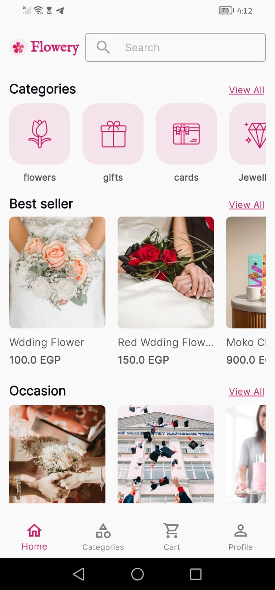
</p>

<h1 align="center">🌸 Flowery</h1>
<p align="center">
  A Flutter flower & gift delivery app with real-time order tracking
</p>

<p align="center">
  
  
  
  
</p>

---

## 📱 Screenshots

### 🏠 Home & Browse
<p float="left">
  
  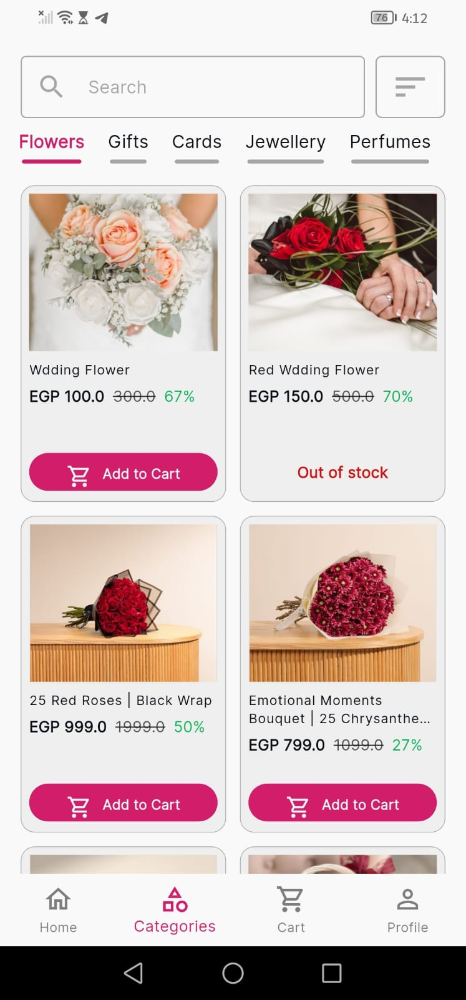
  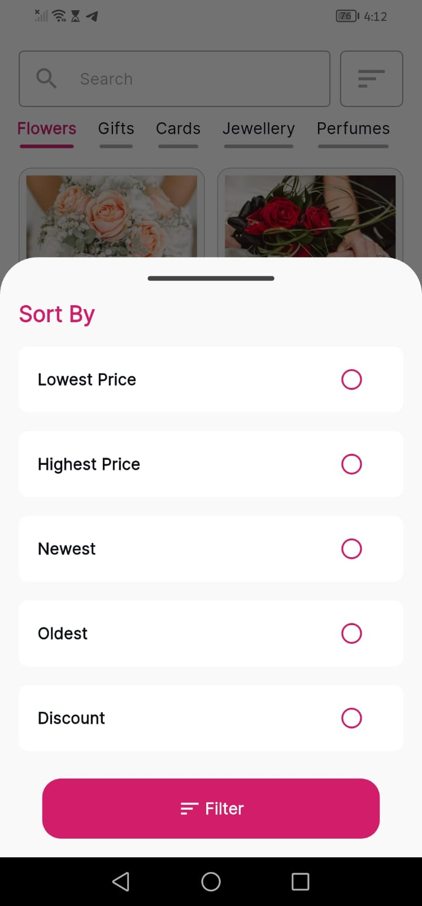
</p>

> Browse flowers, gifts, cards, jewellery and perfumes. Filter & sort by price, discount, or date.

---

### 🌹 Product Details & Cart
<p float="left">
  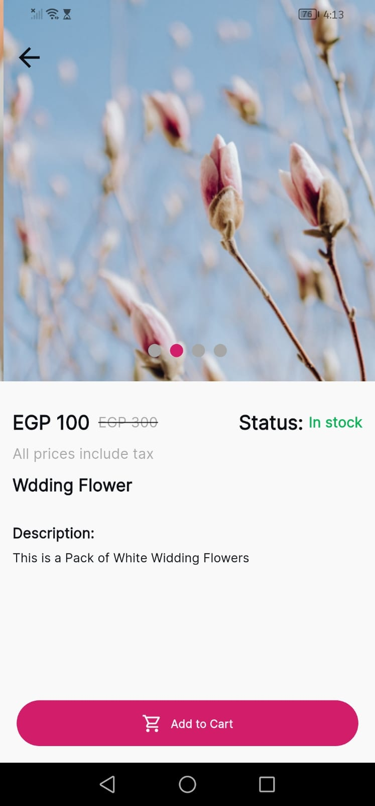
  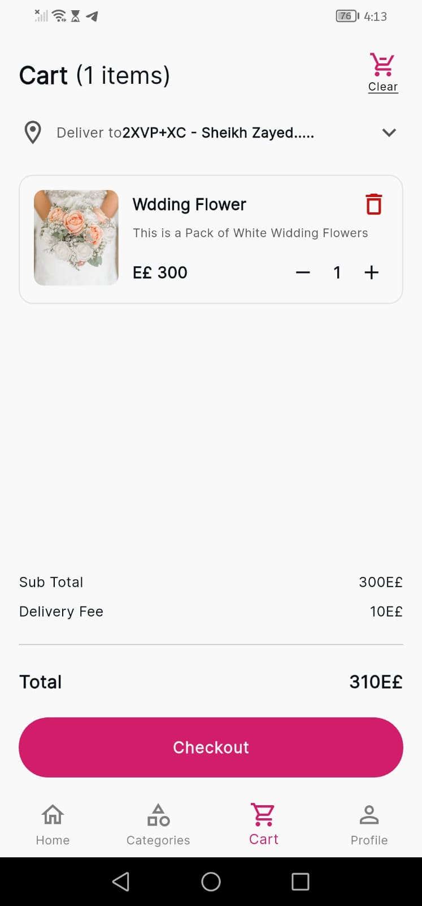
  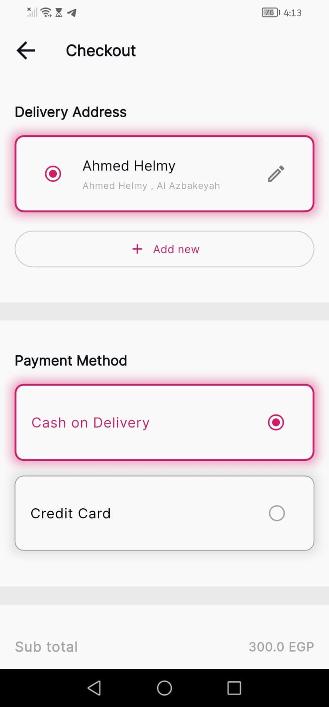
</p>

> View product details with image carousel, discounted pricing, and stock status. Manage cart items and checkout with saved addresses and payment methods.

---

### 📦 Order Tracking
<p float="left">
  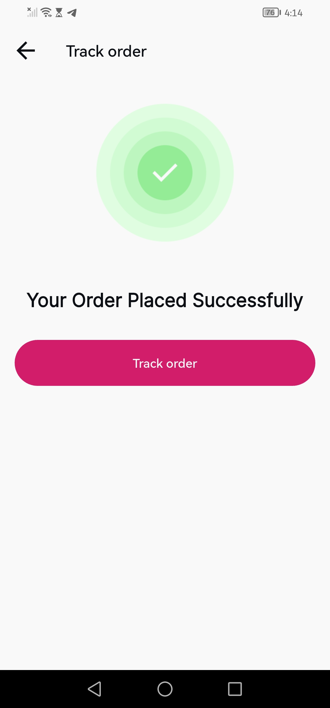
  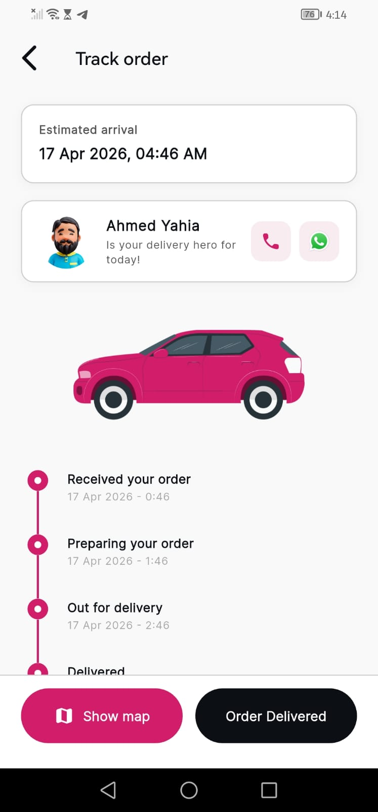
  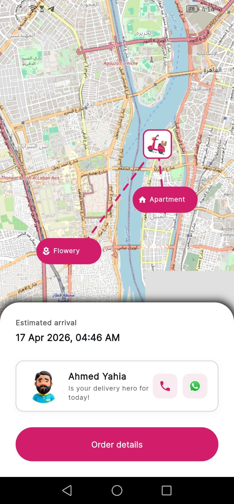
</p>

> After placing an order, track it through a live timeline (Received → Preparing → Out for Delivery → Delivered) with real-time driver location on an interactive map.

---

### 👤 Profile & Notifications
<p float="left">
  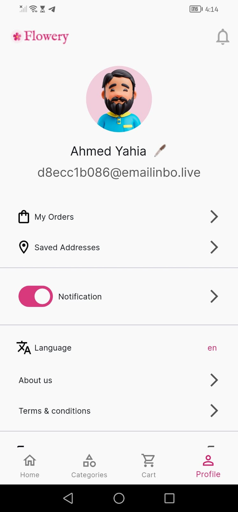
  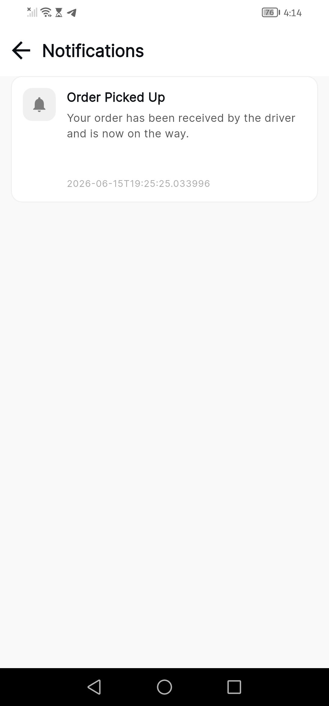
</p>

> Manage your profile, saved addresses, notification preferences, and language settings. Receive push notifications for order status updates.

---

## ✨ Features

- 🌸 **Browse Products** — Flowers, Gifts, Cards, Jewellery, Perfumes with categories & occasions
- 🔍 **Search & Filter** — Sort by price, newest, oldest, or discount percentage
- 🛒 **Cart Management** — Add/remove items, auto-calculated delivery fee & total
- 💳 **Checkout** — Saved delivery addresses, Cash on Delivery & Credit Card support
- 📍 **Real-time Tracking** — Live driver location on map with animated route
- 🔔 **Push Notifications** — Order status updates (picked up, delivered, etc.)
- 👤 **User Profile** — Edit name/avatar, manage addresses, toggle notifications
- 🌐 **Multi-language** — Language switcher (Arabic / English)

---

## 🏗️ Architecture

This project follows **Clean Architecture** principles:

```
lib/
├── core/               # Shared utilities, constants, theme
├── features/
│   ├── home/           # Home screen with categories & best sellers
│   ├── categories/     # Product listing with search & filter
│   ├── product/        # Product details screen
│   ├── cart/           # Cart management
│   ├── checkout/       # Address selection & payment
│   ├── tracking/       # Order tracking with map
│   ├── notifications/  # Notification history
│   └── profile/        # User profile & settings
└── main.dart
```

Each feature is divided into **3 layers**:

| Layer | Responsibility |
|-------|---------------|
| `data` | Models, Mappers, Firebase data sources, Repository impl |
| `domain` | Entities, Repository interfaces, Use cases |
| `presentation` | BLoC/Cubit, Screens, Widgets |

---

## 🛠️ Tech Stack

| Technology | Usage |
|------------|-------|
| **Flutter** | Cross-platform UI framework |
| **Firebase Firestore** | Real-time database for orders & products |
| **Firebase Auth** | User authentication |
| **Firebase Messaging** | Push notifications (FCM) |
| **flutter_map** | Interactive map with driver tracking |
| **BLoC / Cubit** | State management |
| **GetIt / Injectable** | Dependency injection |
| **go_router** | Declarative navigation |
| **url_launcher** | Call & WhatsApp driver contact |

---

## 🚀 Getting Started

### Prerequisites

- Flutter SDK `>=3.0.0`
- Dart `>=3.0.0`
- Firebase project configured

### Installation

```bash
# Clone the repository
git clone https://github.com/your-username/flowery.git
cd flowery

# Install dependencies
flutter pub get

# Run the app
flutter run
```

### Firebase Setup

1. Create a Firebase project at [console.firebase.google.com](https://console.firebase.google.com)
2. Add your Android / iOS apps
3. Download `google-services.json` (Android) and `GoogleService-Info.plist` (iOS)
4. Place them in the respective platform directories
5. Enable Firestore, Authentication, and Cloud Messaging

---

## 📂 Firestore Structure

```
users/{userId}
  ├── name
  ├── email
  ├── photoUrl
  └── addresses[]

products/{productId}
  ├── name
  ├── price
  ├── originalPrice
  ├── images[]
  ├── category
  └── inStock

orders/{orderId}
  ├── userId
  ├── items[]
  ├── status         # received | preparing | out_for_delivery | delivered
  ├── driverLocation { lat, lng }
  ├── estimatedArrival
  └── createdAt
```

---

## 🤝 Contributing

Pull requests are welcome! For major changes, please open an issue first to discuss what you would like to change.

---

## 📄 License

This project is licensed under the MIT License.

---

<p align="center">Made with ❤️ using Flutter</p>